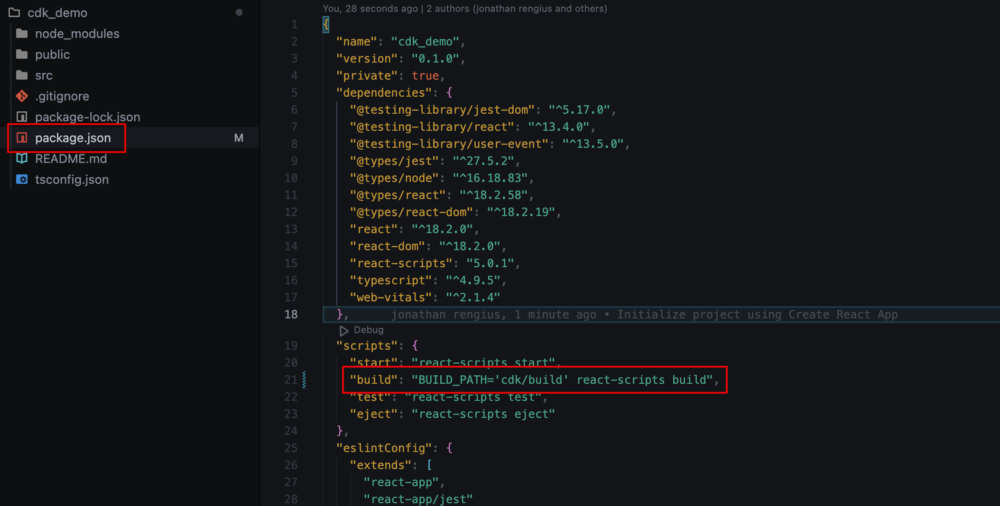

# CDK React app with TypeScript

## Intro

There is multiple ways to handle your infrastructure as code, such as CloudFormation, CDK and Terraform.
This post will focus on CDK, which stands for AWS Cloud Development Kit. We will set up a React app as a dummy frontend and then use CDK to deploy it to AWS. The Goal of the task is not to learn React but to try CDK out and use it in practice.

We want to achieve this:


## CDK

With CDK, you can use familiar programming languages like TypeScript, Python, Java, or C#, abstracting away the complexity of AWS CloudFormation. It offers reusable components, integration with various AWS services, and benefits like type safety and IDE support. CDK simplifies infrastructure management, encourages best coding practices, and nurtures collaboration within development teams.

Taken from the [official documentation](https://docs.aws.amazon.com/cdk/v2/guide/home.html) by AWS:

"The AWS Cloud Development Kit (AWS CDK) is an open-source software development framework for defining cloud infrastructure in code and provisioning it through AWS CloudFormation."

One important thing to know about CDK is that when it compiles, it compiles down to CloudFormation templates which then are used for the deployment into AWS. This means that CDK is an extra layer on top of CloudFormation that makes it easier to read and digest.

What I like most with CDK is that it decreases the knowledge gap for software developers to learn infrastructure as code. I am currently myself working on a project where we have TypeScript throughout the whole project. Meaning, backend in node/TypeScript, frontend in React/TypeScript and the infrastructure defined with CDK in TypeScript.

### Prerequisites

- Make sure you have node 14.15.0 or later installed on your machine.
- Make sure you have TypeScript installed: `npm -g install typescript`
- Setup and configure AWS CLI and CDK Toolkit

### AWS CLI and CDK ToolKit setup

If you do not already have the AWS CLI and the CDK Toolkit setup and configured, here are a few links on how to get that done:

- To install AWS CLI [click here](https://docs.aws.amazon.com/cli/latest/userguide/getting-started-version.html). Choose you OS and follow the instructions.
- To configure AWS CLI [click here](https://docs.aws.amazon.com/cli/latest/userguide/getting-started-quickstart.html#getting-started-quickstart-new-command). Choose a way to configure.
- To get started with CDK Toolkit [click here](https://docs.aws.amazon.com/cdk/v2/guide/cli.html)

## Lets get started with creating our React app

- Create a new folder on your machine -> `mkdir cdk_demo`
- Navigate to you newly created folder -> `cd cdk_demo`
- Run: `npx create-react-app cdk_demo --template typescript` to create your React app.
- Navigate to your app -> `cd cdk_demo`
- Open you app in a code editor. I will be using VS Code. The command to open the project in VS code from the terminal is: `code .`

## Configuring you React app

Now we need to do some modifications to this standard create-react-app.

To decide where the compiled React app should be saved, we need to modify the current build script in the package.json file with this: ` "build": "BUILD_PATH='cdk/build' react-scripts build"`. We will later use this path to tell CDK where to get the files that we wish to deploy.



### Initiate the CDK app inside of the React project

The next step will be to initiate our CDK configuration.

- In the root of the project, create a folder where we want our infrastructure configurations to reside. I am calling this folder cdk.

  

- Navigate to the folder you just created -> `cd cdk`
- Now initiate the CDK with TypeScript in this folder -> `cdk init app --language typescript`
- You should now have something that looks like this:

  

### Configure CDK

First things first. We want to specify an out directory where the compiled CDK project will be saved. This is to gather the compiled files in a folder, instead of them being mixed with all the other files.

- Inside the cdk folder we need to modify the tsconfig.json with this: `"outDir": "cdk_build"`

  

## Lets start adding our infrastructure

Now we can finally start adding our infrastructure definitions to our project.

- Inside the cdk folder, navigate to the folder lib. Create a new file here called deployment.ts and add this code.

```javascript
import { Construct } from "constructs";
import { CfnOutput, RemovalPolicy } from "aws-cdk-lib";
import { Distribution, ViewerProtocolPolicy } from "aws-cdk-lib/aws-cloudfront";
import { S3Origin } from "aws-cdk-lib/aws-cloudfront-origins";
import { BlockPublicAccess, Bucket } from "aws-cdk-lib/aws-s3";
import { BucketDeployment, Source } from "aws-cdk-lib/aws-s3-deployment";

// Note that we define our path here to the compiled react folder
const path = "./build";

export class Deployment extends Construct {
  constructor(scope: Construct, id: string) {
    super(scope, id);

    // Creating the bucket where we want to deploy our React app
    const hostingBucket = new Bucket(this, "FrontendBucket", {
      autoDeleteObjects: true,
      blockPublicAccess: BlockPublicAccess.BLOCK_ALL,
      removalPolicy: RemovalPolicy.DESTROY,
    });

    // Creating a cloudfront distribution which is used to deliver the app to the user
    const distribution = new Distribution(this, "CloudfrontDistribution", {
      defaultBehavior: {
        origin: new S3Origin(hostingBucket),
        viewerProtocolPolicy: ViewerProtocolPolicy.REDIRECT_TO_HTTPS,
      },
      defaultRootObject: "index.html",
      errorResponses: [
        {
          httpStatus: 404,
          responseHttpStatus: 200,
          responsePagePath: "/index.html",
        },
      ],
    });

    // Creating the actual deployment
    new BucketDeployment(this, "BucketDeployment", {
      sources: [Source.asset(path)],
      destinationBucket: hostingBucket,
      distribution,
      distributionPaths: ["/*"],
    });

    // Here we are outputting the URL that we can use to browse our webapp.
    new CfnOutput(this, "CloudFrontURL", {
      value: distribution.domainName,
      description: "The distribution URL",
      exportName: "CloudfrontURL",
    });
    // Here we are outputting the name of the bucket we created
    new CfnOutput(this, "BucketName", {
      value: hostingBucket.bucketName,
      description: "The name of the S3 bucket",
      exportName: "BucketName",
    });
  }
}
```


We are creating this Deployment file to follow AWS [best practice](https://docs.aws.amazon.com/cdk/v2/guide/best-practices.html) that tells us to build constructs that we can re-use.

### Calling our Deployment class from our main cdk file

Now when we have created our infrastructure definitions inside the deployment.ts file, we need to call it from the main infrastructure class inside the file called cdk-stack.ts.

- Still in the lib folder, open the file cdk-stack.ts and replace the code with this:

```javascript
import * as cdk from "aws-cdk-lib";
import { Construct } from "constructs";
import { Deployment } from "./deployment";

export class CdkStack extends cdk.Stack {
  constructor(scope: Construct, id: string, props?: cdk.StackProps) {
    super(scope, id, props);
    // Calling our infrastructure definitions
    new Deployment(this, "deployment");
  }
}
```


### The last step of the process...

The last step of the setup is to update our main CDK file with some deployment information.

- Update the file cdk.ts in the bin folder with the following. Make sure you change account to your account id and region to the region you wish to deploy to.

```javascript
#!/usr/bin/env node
import "source-map-support/register";
import * as cdk from "aws-cdk-lib";
import { CdkStack } from "../lib/cdk-stack";

const app = new cdk.App();
new CdkStack(app, "CdkStack", {
  env: {
    account: "account id",
    region: "region_to_deploy_to",
  },
});
```


## Deployment time

Now when everything is setup and done we can try out the deployment.

- Make sure you are in the root of the react project and run -> `npm install && npm run build` to build the React app
- Navigate to the cdk folder -> `cd cdk`
- Run `cdk bootstrap` to prepare your environment
- Run `cdk synth` to test your configuration and preview the CloudFormation template to be deployed
- Run `cdk deploy` to deploy the template to AWS. (You will get a question if you want to deploy. Type y to approve)

When the deployment is done you will see a URL in the output, copy that and paste in a web browser to test

Also head over to CloudFormation in the AWS console to checkout your newly created resources.


## Dont forget...

...to delete all the resources created to not incur charges. You can do this via CDK by running `cdk destroy` or you can do it through the console ->


## Lessons learned

When deleting your stacks through the console. Make sure you delete the CdkStack first and then delete the CDKToolkit stack. If you do it like I did by mistake, deleting the CDKToolkit stack first. You will not be able to delete your CdkStack since the role with the required permissions to delete the stack has in it self been deleted...

What i did to remedy this unfortunate situation was to create a new temporary role with the same name as the role that was missing. You can get the name of the role in the error message that you will receive. This role you need to give the required permissions to delete the stack. I found this solution on stack overflow:

"Go to IAM > roles > create role > click on cloudformation for the service > make sure you give it the right permissions so that cloudformation can delete the stack. (In my case I gave it admin permissions because I was planning to delete the role straight after I deleted the stack) > for Role name use the same role name in the error message."

Make sure to delete this role when the stack has been deleted.

## Deep dive

If you want to dive deeper into CDK I have prepared a few links.

- If you are not familiar with CDK visit the [CDK documentation](https://docs.aws.amazon.com/cdk/v2/guide/home.html) and browse through it.
- If you are looking for a quicker way to grasp the concept, you can check this video out about CDK: [CDK intro](https://www.youtube.com/watch?v=nlb8yo7SZ2I)
- In this post we have set up Cloudfront so if you want to refresh you knowledge here is a video: [Cloudfront](https://www.youtube.com/watch?v=AT-nHW3_SVI)
- If you want another hands-on tutorial in CDK. Have a look at this official AWS tutorial: [CDK tutorial](https://aws.amazon.com/getting-started/guides/setup-cdk/?ref=gsrchandson)

## To summarize

My key takeaway from this post is that CDK is NICE! On a more serious note. I find that CDK is a perfect tool for AWS developers that are interested in extending their knowledge to more architectural work. With this tool it becomes easy and also quite fun to work with IAC. Instead of me constantly worrying of the YAML syntax with CloudFormation, I can now have AWS handle that part and focus on whats fun -> coding.
