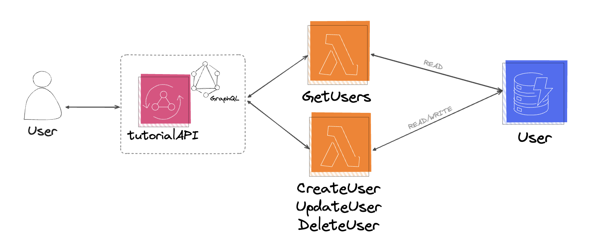
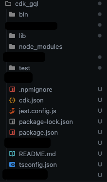
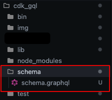
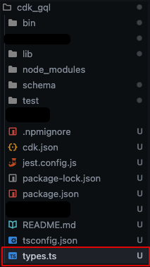
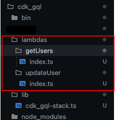
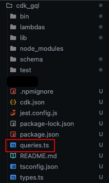
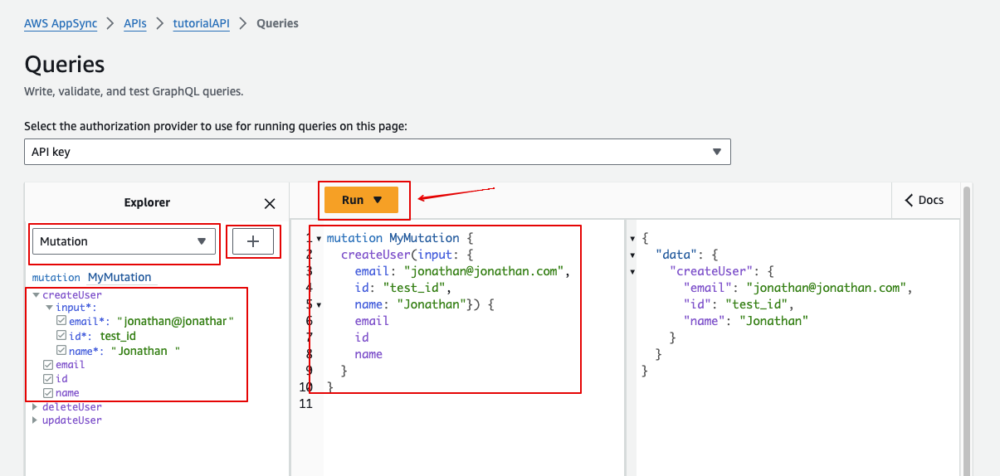

# Deploy a Appsync GraphQL API with lambda resolvers pointing to a DynamoDB table using CDK

## Intro

Creating reliable and scalable APIs is super important when working with modern web and mobile apps. GraphQL has become a go-to solution, offering flexibility and efficiency. Deploying a GraphQl API through the AWS console is easy but how would you streamline the process even further?

In this simple guide, I'll show you how to use AWS CDK to deploy an AppSync API with GraphQL. AWS CDK lets you define cloud infrastructure using familiar programming languages like TypeScript or Python, making deployment easier and more efficient.

Whether you're new to GraphQL or looking for a smoother deployment process, this guide will walk you through deploying a GraphQL API using AWS CDK.

What we want to achieve in the end:



## GraphQL

GraphQL is a query language for APIs and a runtime for executing those queries. It was developed by Facebook in 2012 and later released as an open-source project in 2015. Here is why I like GraphQL and whats I think is nice about it.

It is **flexible**: GraphQL allows clients to request exactly the data they need, nothing more and nothing less, by specifying the structure of the data they require in the query. This flexibility is different from traditional REST APIs where endpoints often return fixed data structures.

It leverages a **\*single endpoint**: Unlike REST APIs where you typically have multiple endpoints for different resources, GraphQL APIs have a single endpoint for all data operations. This simplifies API management and reduces the number of network requests needed to fetch related data.

It has a **strongly typed schema**: GraphQL APIs are built around a strongly typed schema, which serves as a contract between the client and the server. The schema defines the types of data that can be queried, including objects, enums, interfaces, and unions, as well as the operations that can be performed.

It is **self explanatory**: GraphQL APIs are self-descriptive, meaning that clients can query the schema itself to discover the available types and operations.

It is **efficient**: With GraphQL, clients can fetch multiple resources and their relationships in a single request, reducing over-fetching and under-fetching. This is particularly useful for frontend developers who need to optimize network requests and reduce latency in web and mobile applications.

It is constantly **evolving**: GraphQL APIs support gradual schema evolution without breaking changes, thanks to the schema's versioning capabilities and the ability to deprecate fields and types. This allows APIs to evolve over time while maintaining backward compatibility with existing clients.

It has a great **community**: GraphQL has a thriving community and a rich ecosystem of tools and libraries that make it easy to build, deploy, and manage GraphQL APIs. This includes libraries for server-side frameworks (e.g., Apollo Server, Express GraphQL), client-side frameworks (e.g. Apollo Client, Relay), and tools for schema management, testing, and performance monitoring.

Overall, GraphQL offers a more efficient, flexible, and developer-friendly approach to building and consuming APIs compared to traditional REST APIs, making it a great choice for many modern web and mobile applications.

## Prerequisites

- Make sure you have node 14.15.0 or later installed on your machine
- Make sure you have TypeScript installed: `npm -g install typescript`
- Setup and configure AWS CLI and CDK Toolkit

## AWS CLI and CDK ToolKit setup

If you do not already have the AWS CLI and the CDK Toolkit setup and configured, here are a few links on how to get that done:

- To install AWS CLI [click here](https://docs.aws.amazon.com/cli/latest/userguide/getting-started-version.html). Choose you OS and follow the instructions.
- To configure AWS CLI [click here](https://docs.aws.amazon.com/cli/latest/userguide/getting-started-quickstart.html#getting-started-quickstart-new-command). Choose a way to configure.
- To get started with CDK Toolkit [click here](https://docs.aws.amazon.com/cdk/v2/guide/cli.html)

## Lets get started

### Step 1: Initiate your CDK project

To get started you need to initiate a new CDK project.

- Create a folder where you want your project to reside. `mkdir cdk_gql`
- Navigate to the folder you just created -> `cd cdk_gql`
- Now initiate the CDK with TypeScript in this folder -> `cdk init app --language typescript`
- You should now have something that looks like this:



(Don't pay attention to whats been crossed over, it will be revealed later on)

### Step 2: Create your GraphQL schema

Since we are creating a GraphQL API we will need a schema for it. So lets start with adding that.

- Make sure you are in the root of your project
- Create a new folder and name it schema
- Inside of this folder create a new file and name it to: `schema.graphql`



- In the `schema.graphql` file add the following as your schema:

```
input CreateUserInput {
  id: ID!
  name: String!
  email: String!
}

input UpdateUserInput {
  id: ID!
  name: String
  email: String
}

type User {
  id: ID!
  name: String!
  email: String!
}

type Mutation {
  createUser(input: CreateUserInput!): User
  updateUser(input: UpdateUserInput!): User
  deleteUser(id: ID!): User
}

type Query {
  getUsers(id: String): [User]
}

```

Lets have a deeper look on what this schema does:

- We have user input types
  - CreateUserInput: This input type is used to create a new user. It includes the fields id, name, and email, all of which are required. You can tell that they are required because they are highlighted with an exclamation mark.
  - UpdateUserInput: This input type is used when updating an existing user. It includes the id field to identify the user and optional fields name and email that can be updated. Note that name and email are not mandatory.
- We have the type of the user
  - User: This object type represents a user. It includes fields id, name, and email, all of which are required.
- We have the Mutation type
  - Mutation: This type defines operations that can modify data (create, update, delete). Inside of this type we have the actual mutations
    - createUser(input: CreateUserInput!): This mutation creates a new user and returns the created user.
    - updateUser(input: UpdateUserInput!): This mutation updates an existing user and returns the updated user.
    - deleteUser(id: ID!): This mutation deletes a user identified by the provided ID and returns the deleted user.
- We have the Query type
  - Query: This type defines operations for querying data. Inside of this type we have the actual query
    - getUsers(id: String): This query retrieves users based on an optional ID parameter. If no ID is provided, it returns all users. The return type is an array of User objects.

### Step 3: Create types based of the GQL schema

For the sake of simplicity we will manually create the types that we will use in our lambdas based of the GraphQL schema we just created. If you would like to automate this process I would recommend looking into [grapgql-codegen](https://the-guild.dev/graphql/codegen), which can be leveraged to generate types from your schema.

- Make sure you are in the root of your project.
- Create a new file and name it to: `types.ts`



- In the `types.ts` file add the following as your types:

```javascript
export const enum EOperation {
  create = "create",
  update = "update",
  delete = "delete",
}

// User
export interface IUser {
  id: string;
  name: string;
  email: string;
}

export interface ICreateUserArgs {
  input: {
    id: string;
    name: string;
    email: string;
  };
}

export interface IUpdateUserArgs {
  input: {
    id: string;
    name?: string;
    email?: string;
  };
}

export interface IDeleteUserArgs {
  id: string;
}

export type TArgs = ICreateUserArgs | IUpdateUserArgs | IDeleteUserArgs;

```

Note that the interfaces are based of how the GraphQL schema look like. The difference is that we have one extra type named `TArgs` and we also have a enum here that is named `EOperation`. These will be used in the update resolver lambda that we will go through in step 5.

### Step 4: Add your infrastructure

Now we will start to add our infrastructure that is required to make all of this possible.

- Go to the folder lib and open the file `cdk_gql-stack.ts` and replace the content with the following:

```javascript
import * as cdk from "aws-cdk-lib";
import { Construct } from "constructs";
import * as appsync from "aws-cdk-lib/aws-appsync";
import { AttributeType, Table } from "aws-cdk-lib/aws-dynamodb";
import { NodejsFunction } from "aws-cdk-lib/aws-lambda-nodejs";
import { Runtime } from "aws-cdk-lib/aws-lambda";
import path = require("path");

export class CdkGqlStack extends cdk.Stack {
  constructor(scope: Construct, id: string, props?: cdk.StackProps) {
    super(scope, id, props);

    const api = new appsync.GraphqlApi(this, "tutorialAPI", {
      name: "tutorialAPI",
      schema: appsync.SchemaFile.fromAsset("schema/schema.graphql"),
    });

    const userTable = new Table(this, "user", {
      partitionKey: { name: "id", type: AttributeType.STRING },
    });

    const getUsersLambda = new NodejsFunction(this, "getUsersLambdaHandler", {
      runtime: Runtime.NODEJS_20_X,
      entry: path.join(__dirname, `/../lambdas/getUsers/index.ts`),
      handler: "handler",
      environment: {
        USER_TABLE: userTable.tableName,
      },
    });

    const usersDataSource = api.addLambdaDataSource(
      "getUsersLambda",
      getUsersLambda
    );

    usersDataSource.createResolver(`getUsersLambdaResolver`, {
      typeName: "Query",
      fieldName: "getUsers",
       requestMappingTemplate: appsync.MappingTemplate.fromString(`{
        "version": "2017-02-28",
        "operation": "Invoke",
        "payload": {
          "arguments": $util.toJson($context.arguments)
        }
      }`),
    });

    const updateUserLambda = new NodejsFunction(
      this,
      "updateUserLambdaHandler",
      {
        runtime: Runtime.NODEJS_20_X,
        entry: path.join(__dirname, `/../lambdas/updateUser/index.ts`),
        handler: "handler",
        environment: {
          USER_TABLE: userTable.tableName,
        },
      }
    );
    const updateUsersDataSource = api.addLambdaDataSource(
      "updateUserLambda",
      updateUserLambda
    );

    updateUsersDataSource.createResolver(`createUserLambdaResolver`, {
      typeName: "Mutation",
      fieldName: "createUser",
      requestMappingTemplate: appsync.MappingTemplate.fromString(`{
        "version": "2017-02-28",
        "operation": "Invoke",
        "payload": {
          "arguments": $util.toJson($context.arguments),
          "operation": "create"
        }
      }`),
    });

    updateUsersDataSource.createResolver(`updateUserLambdaResolver`, {
      typeName: "Mutation",
      fieldName: "updateUser",
      requestMappingTemplate: appsync.MappingTemplate.fromString(`{
        "version": "2017-02-28",
        "operation": "Invoke",
        "payload": {
          "arguments": $util.toJson($context.arguments),
          "operation": "update"
        }
      }`),
    });

    updateUsersDataSource.createResolver(`deleteUserLambdaResolver`, {
      typeName: "Mutation",
      fieldName: "deleteUser",
      requestMappingTemplate: appsync.MappingTemplate.fromString(`{
        "version": "2017-02-28",
        "operation": "Invoke",
        "payload": {
          "arguments": $util.toJson($context.arguments),
          "operation": "delete"
        }
      }`),
    });

    userTable.grantReadData(getUsersLambda);
    userTable.grantReadWriteData(updateUserLambda);

    new cdk.CfnOutput(this, "GraphQLAPIURL", {
      value: api.graphqlUrl,
    });

    new cdk.CfnOutput(this, "GraphQLAPIKey", {
      value: api.apiKey || "",
    });
  }
}

```

What we are doing here:

- Add the Appsync API for GraphQL
- Add the DynamoDB table
- Add one lambda that will be used for our query
  - Assign the lambda to the API as a data source
  - Create one GraphQL resolver, assign it to the data source and define that it is a Query
- Add one lambda that will be used for our three mutations
  - Assign the lambda to the API as a data source
  - Create three GraphQL resolvers, assign them to the data source and define that they are Mutations
    - One for Create
    - One for Update
    - One for Delete
  - Note that we are adding a requestMappingTemplate to the mutations. Here we have the different operations that we will use to distinguish which mutation is which.
- Give the query lambda READ permissions to the DynamoDB table
- Give the mutation lambda READ and WRITE permissions to the DynamoDB table

With the GraphQL stack ready we can head over to the bin folder and open the file named `cdk_gql.ts` and replace the content with the following:

```javascript
#!/usr/bin/env node
import "source-map-support/register";
import * as cdk from "aws-cdk-lib";
import { CdkGqlStack } from "../lib/cdk_gql-stack";

const app = new cdk.App();
new CdkGqlStack(app, "CdkGqlStack", {
  env: {
    account: "deployment_account",
    region: "deployment_region",
  },
});
```

What we are doing here:

- We are calling our GraphQL deployment stack in the main CDK file.
- Be sure to change `deployment_account` to your account id and `deployment_region` to your preferred region.

### Step 5: Add your lambdas & supporting functions

Now when all our infrastructure is defined we need to create our lambda functions so that our resolvers can return something.

- Make sure you are in the root of the project.
- Create a `.env` file and store the name of your user table: USER_TABLE="user"
- Create a new folder and name it lambdas
- Inside of the lambda folder create two more folders:
  - getUsers -> add a file named `index.ts`
  - updateUser -> add a file named `index.ts`



#### getUsers resolver

Lets start with our lambda resolver fo the query. Open the file `index.ts` in your getUsers folder and paste the following code:

```javascript
import { Handler } from "aws-cdk-lib/aws-lambda";

import { DynamoDB } from "aws-sdk";

// Initiating DymamoDB
const dynamo = new DynamoDB.DocumentClient();
// Grabbing our table name from our environment variable
const userTable: string = process.env.USER_TABLE!;

// Defining how our event will look like
interface IUsersEvent {
  // Since the id can be undefined we are also defining this here
  arguments: {
    id?: string;
  };
}

export const handler: Handler = async (event: IUsersEvent) => {
  try {
    const id = event.arguments.id;
    // Creating the parameters that we will send to dynamoDB. If the id is undefined we scan for all entries,
    // if it is not we only scan for the entry with the id.
    const params: AWS.DynamoDB.DocumentClient.ScanInput = {
      TableName: userTable,
      ...(id
        ? {
            FilterExpression: "id = :value",
            ExpressionAttributeValues: {
              ":value": id,
            },
          }
        : {}),
    };
    // Getting the users
    const users = await dynamo.scan(params).promise();

    // Returning the users
    return users.items;
  } catch (error) {
    // Throwing an error if one was caught.
    throw error;
  }
};

```

#### updateUser resolver

This lambda resolver is a bit more complex but I have added comments to explain what is happening.

To summarize it:
Since we are pointing all of our three mutation resolvers to the same lambda we need a way of distinguishing between them. For that some extra logic has been added.

```javascript
import { Handler } from "aws-cdk-lib/aws-lambda";

import { DynamoDB } from "aws-sdk";
// Importing our different event interfaces that we created in types.ts
import {
  TArgs,
  EOperation,
  ICreateUserArgs,
  IUpdateUserArgs,
  IDeleteUserArgs,
  IUser,
} from "../../types";
import { getUser } from "../../queries";

// Initiating DymamoDB
const dynamo = new DynamoDB.DocumentClient();
// Grabbing our table name from our environment variable
const userTable: string = process.env.USER_TABLE!;

// Defining how our event will look like
export interface IUpdateUsersEvent {
  // Since the arguments can be create args, update args or delete args we are using a type that can be all three.
  arguments: TArgs;
  // If the operation is create, update or delete
  operation: EOperation;
}

// a function to check if the arguments are create arguments
function isCreateArgs(
  _arguments: TArgs,
  operation: EOperation
): _arguments is ICreateUserArgs {
  return operation === EOperation.create;
}

// a function to check if the arguments are update arguments
function isUpdateArgs(
  _arguments: TArgs,
  operation: EOperation
): _arguments is IUpdateUserArgs {
  return operation === EOperation.update;
}

// a function to check if the arguments are delete arguments
function isDeleteArgs(
  _arguments: TArgs,
  operation: EOperation
): _arguments is IDeleteUserArgs {
  return operation === EOperation.delete;
}

export const handler: Handler = async (event: IUpdateUsersEvent) => {
  try {
    let user: IUser;
    // Depending on what arguments we get we send the request to different functions
    if (isCreateArgs(event.arguments, event.operation)) {
      user = await createUser(event.arguments);
    } else if (isUpdateArgs(event.arguments, event.operation)) {
      user = await updateUser(event.arguments);
    } else if (isDeleteArgs(event.arguments, event.operation)) {
      user = await deleteUser(event.arguments);
    } else {
      throw new Error("Invalid operation");
    }

    // Finally returning the user
    return user;
  } catch (error) {
    // Throwing an error if one was caught
    throw error;

  }
};

// Function to create a user
async function createUser(args: ICreateUserArgs) {
// This function is reused to many times so it is defined in a different file and then re-used
  const user = await getUser(args.input.id, dynamo);

// If the user already exist we throw an error
  if (user.Item) {
    throw new Error("User already exists");
  }

// Defining the user object that we will send to DynamoDB
  const item: IUser = {
    id: args.input.id,
    name: args.input.name,
    email: args.input.email,
  };

// Defining the parameters for the DynamoDB Request
  const params: AWS.DynamoDB.DocumentClient.PutItemInput = {
    TableName: userTable,
    Item: item,
  };

  // Adding the user
  await dynamo.put(params).promise();

  user = await getUser(args.input.id, dynamo);

  // If the user for some reason does not exist after create we throw a internal error
  if (!user) {
    throw new Error(`Internal Error: User missing for id ${args.input.id}`);
  }

  // returning the user
  return user.Item as IUser;
}

// Function to update a user
async function updateUser(args: IUpdateUserArgs) {
// This function is reused to many times so it is defined in a different file and then re-used
  let user = await getUser(args.input.id, dynamo);

// If the user do not exist we throw an error
  if (!user.Item) {
    throw new Error(`User with id ${args.input.id} does not exist`);
  }

// Defining the parameters for the DynamoDB Request
  const params: AWS.DynamoDB.DocumentClient.UpdateItemInput = {
    TableName: userTable,
    Key: {
      id: args.input.id,
    },
    UpdateExpression: "set #email = :email, #name = :name",
    ExpressionAttributeNames: {
      "#email": "email",
      "#name": "name",
    },
    ExpressionAttributeValues: {
      // If argument is not undefined we update the user with the new value. Otherwise we keep the old.
      ":email": args.input.email ?? user.Item.email,
      ":name": args.input.name ?? user.Item.name,
    },
  };

  // Updating the user
  await dynamo.update(params).promise();

  user = await getUser(args.input.id, dynamo);

  // If the user for some reason does not exist after update we throw a internal error
  if (!user) {
    throw new Error(`Internal Error: User missing for id ${args.input.id}`);
  }
  // returning the user
  return user.Item as IUser;
}

// Function to delete a user
async function deleteUser(args: IDeleteUserArgs) {
  // This function is reused to many times so it is defined in a different file and then re-used
  let user = await getUser(args.id, dynamo);

// If the user do not exist we throw an error
  if (!user.Item) {
    throw new Error(`User with id ${args.id} does not exist`);
  }

// Defining the parameters for the DynamoDB Request
  const params: AWS.DynamoDB.DocumentClient.DeleteItemInput = {
    TableName: userTable,
    Key: {
      id: args.id,
    },
  };
  // Deleting the user
  await dynamo.delete(params).promise();

  // returning the user
  return user.Item as IUser;
}

```

#### getUser query function

Since the getUser function is being used so many times it should be created in its own file.

- Make sure you are in the root of the project.
- Create a new file and name it to `queries.ts`



Add the following code:

```javascript
const userTable: string = process.env.USER_TABLE!;

export async function getUser(id: string, dynamo: AWS.DynamoDB.DocumentClient) {
  return await dynamo
    .get({
      TableName: userTable,
      Key: {
        id,
      },
    })
    .promise();
}

```

### Step 6: Build and deploy

- From the root of the project:
  - Run `cdk bootstrap` to prepare your environment
  - Run `cdk synth` to test your configuration and preview the CloudFormation template to be deployed
  - Run `cdk deploy` to deploy the template to AWS. (You will get a question if you want to deploy. Type y to approve)

### Step 7: Test

To test your newly created GraphQL API:

- Head over to the AWS console and navigate to AppSync
- Click on your API
- Click `Run a Query`
- You will see your different mutations and your query
- Select the create mutation to create your first user:



## Deep Dive

If you found this interesting and want to learn more. I have a few links prepared for you.

- If you are not familiar with CDK visit the [CDK documentation](https://docs.aws.amazon.com/cdk/v2/guide/home.html) and browse through it.
- If you want to learn more about GraphQL. [Here](https://graphql.org/learn/) you have the docs
- If you are looking for a quicker way to grasp the concept, you can check this video out about CDK: [CDK intro](https://www.youtube.com/watch?v=nlb8yo7SZ2I)
- If you want another hands-on tutorial in CDK. Have a look at this official AWS tutorial: [CDK tutorial](https://aws.amazon.com/getting-started/guides/setup-cdk/?ref=gsrchandson)

## Summary

I find GraphQL to be a fantastic tool for building APIs due to its efficiency and flexibility in data retrieval. When combined with the CDK, the development experience becomes even more enjoyable. The CDK's ability to provision and manage cloud resources programmatically aligns seamlessly with GraphQL's schema-centric approach, making the entire development process smooth and enjoyable.
